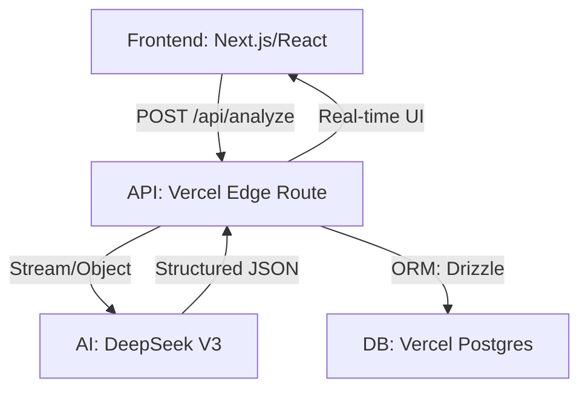

# My AI Architecture

A modern, AI-native full-stack application template built with the Vercel standard technology stack. Optimized for speed, type safety, and structured AI outputs.

[](https://vercel.com/new/clone?repository-url=https%3A%2F%2Fgithub.com%2FcodeF1x%2Fmy-ai-arch&env=DEEPSEEK_API_KEY,DEEPSEEK_BASE_URL,DATABASE_URL)
[](https://your-demo-url.vercel.app)

English | [中文](./README_CN.md)

---

## 🌟 What You Get

- **Structured AI Outputs**: Guaranteed JSON responses using Vercel AI SDK's `generateObject` and Zod validation.
- **Edge-Ready Performance**: Optimized for Vercel Edge Runtime to ensure minimal latency.
- **RAG-Ready Foundation**: Built-in `pgvector` support in the database schema for future semantic search capabilities.
- **Full-Stack Type Safety**: End-to-end TypeScript integration from Drizzle ORM to the React frontend.
- **Streaming Structured Output (streamObject)**: Supports field-by-field streaming generation and real-time UI updates, significantly reducing perceived latency.

## 🎯 Target Audience

- **Frontend / Full-stack Engineers** looking to build AI-native Web applications.
- **Developers** learning Vercel AI SDK and Edge Runtime.
- Anyone wanting a **scalable RAG / GenUI project template**.
- Developers looking to showcase **real AI engineering skills** on their resume.

## 🏗️ Architecture




## 🚀 Tech Stack

- **Framework**: [Next.js 15](https://nextjs.org) (App Router)
- **AI SDK**: [Vercel AI SDK](https://sdk.vercel.ai/docs) (DeepSeek Provider)
- **Database**: [Vercel Postgres](https://vercel.com/docs/storage/vercel-postgres) (powered by Neon)
- **ORM**: [Drizzle ORM](https://orm.drizzle.team/)
- **Styling**: [Tailwind CSS](https://tailwindcss.com/) + [shadcn/ui](https://ui.shadcn.com/)
- **Validation**: [Zod](https://zod.dev/)

## 📜 Core API Contract

The `/api/analyze` endpoint returns a strictly typed JSON object validated by Zod:

```typescript
const analysisSchema = z.object({
  sentiment: z.enum(["positive", "negative", "neutral"]),
  score: z.number().describe("Confidence score (0-1)"),
  reasoning: z.string().describe("Detailed Chain of Thought (CoT)"),
  summary: z.string(),
});
```

## 🛠️ Getting Started

### Prerequisites

- Node.js 18+
- Vercel CLI (`npm i -g vercel`)
- A Vercel account with Postgres database created

### Environment Setup

1. **Clone and Install**

   ```bash
   git clone https://github.com/codeF1x/my-ai-arch.git
   cd my-ai-arch
   npm install
   ```

2. **Link to Vercel**

   ```bash
   vercel link
   vercel env pull .env.local
   ```

3. **Database Migration**
   ```bash
   npx drizzle-kit push
   ```

### Running Locally

```bash
npm run dev
```

## 🗺️ Roadmap

- [ ] **Rate Limiting**: Implement Upstash/Vercel KV for API protection.
- [ ] **Prompt Versioning**: Compare output stability across different prompt versions.
- [ ] **RAG Demo**: Add semantic search using `pgvector` and document embeddings.
- [ ] **Evaluation**: Add a structured evaluation suite for AI response quality.

## 🤝 Contributing

Contributions are what make the open source community such an amazing place to learn, inspire, and create. Any contributions you make are **greatly appreciated**.

Please see [CONTRIBUTING.md](CONTRIBUTING.md) for more details.

## 📄 License

Distributed under the MIT License. See `LICENSE` for more information.
