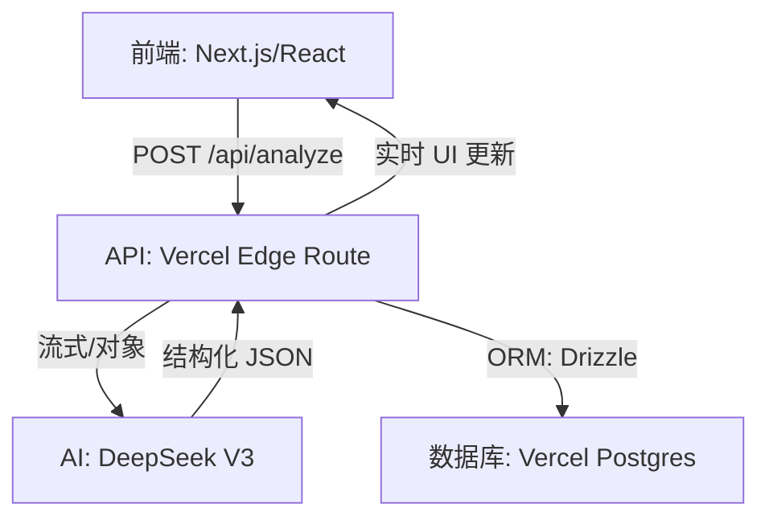

# My AI Architecture (中文版)

一个基于 Vercel 标准技术栈构建的现代 AI 原生全栈应用模板。针对速度、类型安全和结构化 AI 输出进行了深度优化。

[](https://vercel.com/new/clone?repository-url=https%3A%2F%2Fgithub.com%2FcodeF1x%2Fmy-ai-arch&env=DEEPSEEK_API_KEY,DEEPSEEK_BASE_URL,DATABASE_URL,UPSTASH_REDIS_REST_URL,UPSTASH_REDIS_REST_TOKEN)
[](https://your-demo-url.vercel.app)

[English](./README.md) | 中文

---

## 🌟 核心特性

- **结构化 AI 输出**：使用 Vercel AI SDK 的 `generateObject` 配合 Zod 校验，确保 100% 可靠的 JSON 响应。
- **Edge Runtime 优化**：针对 Vercel Edge Runtime 进行了优化，确保极低的 API 响应延迟。
- **RAG 就绪基础**：数据库 Schema 原生支持 `pgvector`，为后续的语义搜索和 RAG 扩展打下基础。
- **全栈类型安全**：从 Drizzle ORM 到 React 前端，实现端到端的 TypeScript 类型推导。
- **流式结构化输出 (streamObject)**：支持逐字段流式生成与 UI 实时更新，显著降低感知延迟。

## 🎯 适合人群

- 希望构建 AI-native Web 应用的前端 / 全栈工程师
- 正在学习 Vercel AI SDK、Edge Runtime 的开发者
- 想要一个可扩展的 RAG / GenUI 项目模板
- 希望在简历中展示真实 AI 工程能力的开发者

## 🏗️ 架构设计




## 🚀 技术栈

- **框架**: [Next.js 15](https://nextjs.org) (App Router)
- **AI SDK**: [Vercel AI SDK](https://sdk.vercel.ai/docs) (DeepSeek Provider)
- **数据库**: [Vercel Postgres](https://vercel.com/docs/storage/vercel-postgres) (由 Neon 驱动)
- **ORM**: [Drizzle ORM](https://orm.drizzle.team/)
- **样式**: [Tailwind CSS](https://tailwindcss.com/) + [shadcn/ui](https://ui.shadcn.com/)
- **校验**: [Zod](https://zod.dev/)

## 📜 核心 API 契约

`/api/analyze` 接口返回由 Zod 严格校验的 JSON 对象：

```typescript
const analysisSchema = z.object({
  sentiment: z.enum(["positive", "negative", "neutral"]),
  score: z.number().describe("置信度 (0-1)"),
  reasoning: z.string().describe("详细的思维链 (CoT) 推理过程"),
  summary: z.string(),
});
```

## 🛠️ 快速上手

### 前置要求

- Node.js 18+
- Vercel CLI (`npm i -g vercel`)
- 一个已创建 Postgres 数据库的 Vercel 账号

### 环境配置

1. **克隆并安装**

   ```bash
   git clone https://github.com/codeF1x/my-ai-arch.git
   cd my-ai-arch
   npm install
   ```

2. **关联 Vercel 项目**

   ```bash
   vercel link
   vercel env pull .env.local
   ```

3. **数据库迁移**
   ```bash
   npx drizzle-kit push
   ```

### 本地运行

```bash
npm run dev
```

## 🗺️ 项目路线图

- [x] **速率限制 (Rate Limiting)**：使用 Upstash/Vercel KV 保护 API 接口。
- [ ] **提示词版本化 (Prompt Versioning)**：对比不同版本 Prompt 的输出稳定性。
- [ ] **RAG 演示**：添加基于 `pgvector` 和文档嵌入的语义搜索功能。
- [ ] **评估系统 (Evaluation)**：添加针对 AI 响应质量的结构化评估套件。

## 🤝 参与贡献

贡献是开源社区的灵魂。我们非常欢迎任何形式的贡献！

请查看 [CONTRIBUTING.md](CONTRIBUTING.md) 了解更多详情。

## 📄 开源协议

本项目基于 MIT 协议开源。详情请见 `LICENSE`。
